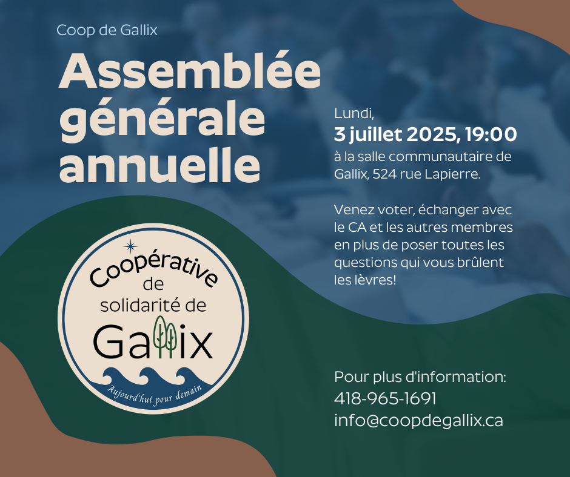

Bonjour,

Le 21 juin dernier devrait être une date à inscrire dans la petite histoire de Gallix avec l'ouverture officielle de notre coop d'alimentation et station-service! 🎉 Celle-ci contribuera incontestablement à la qualité de vie de notre population. L'événement festif a permis de souligner l'apport de nos nombreux partenaires et bénévoles, sans lesquels ce projet serait demeuré un simple rêve. Merci à tous ceux et celles qui, d'une façon ou d'une autre, ont participé à l'organisation de cette activité rassembleuse, qui nous a permis de découvrir des artistes locaux ayant fait preuve d'une grande générosité. Une fête familiale qu'il faudra répéter! 💙

Prenons un moment pour nous remémorer les motivations derrière le projet de coop :

* Sortir le secteur du désert alimentaire ✔
* Donner accès à la population aux biens de première nécessité ✔
* Favoriser les rencontres entre citoyens ✔
* Création d'emplois locaux ✔
* Mise en valeur des produits locaux ✔
* Animer la vie sociale du secteur ✔
* Développer un sentiment de fierté ✔

Plus largement, il y a toujours eu une volonté de faire de la coop un catalyseur du développement socioéconomique du secteur, un peu à l'image de l'ancien magasin général du village. La coop a ouvert ses portes le 16 janvier et parce que vous avez été nombreux à la soutenir depuis, on peut sans contredit parler de succès!

### 👉 Le prochain rendez-vous consiste en l'**assemblée générale annuelle** qui se tiendra au centre communautaire le **3 juillet à 19h**.

Elle servira à tracer le bilan des différentes actions posées à ce jour, faire le point sur les choix qui ont été faits, les enjeux qui sont à nos portes et, comme à chaque AGA, il y aura des postes en élection. L'AGA, c'est l'occasion pour chaque membre de faire entendre sa voix et qui sait, de pousser son implication en se joignant au C.A.

Cette année, **3 postes seront à combler** et le C.A. est particulièrement à la recherche d'une personne ayant des compétences en trésorerie et comptabilité. Le suivi rigoureux des finances de la coop est essentiel à tout le reste. Il y a des enjeux de pérennité, mais aussi d'assurer le développement de l'organisation et le déploiement d'éléments comme la cuisine, la génératrice de secours, la borne de recharge électrique et l'aménagement extérieur. La santé des finances et la justesse des choix qui seront faits au cours des prochaines années seront critiques pour la pérennité de la coop et la vitalité du village.

Un des choix qui s'est avéré judicieux à ce jour est sans contredit celui qui a mené à l'embauche de l'équipe d'employés qui s'affairent aux opérations courantes, une équipe dédiée et engagée dont nous sommes très fiers. Une équipe continuellement appuyée par des bénévoles hors pair qui sont essentiels au bon fonctionnement des activités quotidiennes de la coop. 👏

Ensemble, continuons à faire de notre coop le cœur battant de notre communauté! 💕

Donc, on se dit « à bientôt! »

