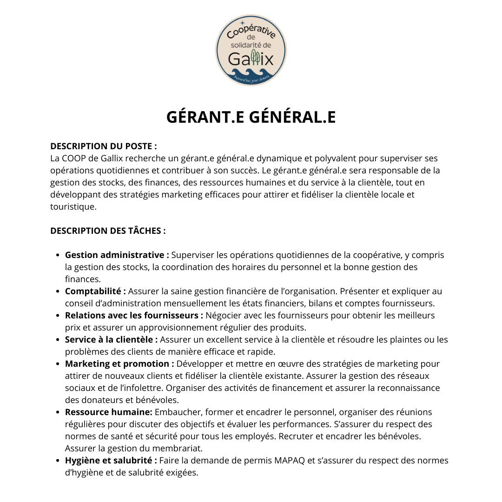
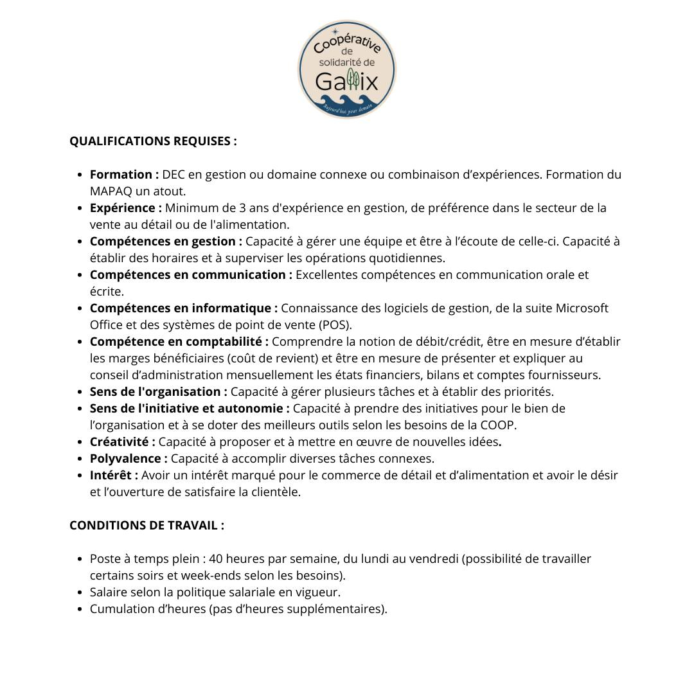

## MISE À JOUR: Poste comblé; nous avons trouvé la perle rare! Merci à tous ceux qui ont partagé l'offre d'emploi et qui ont contribué à la recherche de la personne idéale pour notre COOP! 🎉🎉🎉

On est très fébrile d'annoncer notre 1ère offre d'emploi pour notre COOP de Gallix! Partagez en grand nombre et aidez-nous à trouver la perle rare! 👀🤝📧 
Envoie ton CV à: 𝗶𝗻𝗳𝗼@𝗰𝗼𝗼𝗽𝗱𝗲𝗴𝗮𝗹𝗹𝗶𝘅.𝗰𝗮!!

## Description du poste

La COOP de Gallix recherche un gérant.e général.e dynamique et polyvalent pour superviser ses opérations quotidiennes et contribuer à son succès. Le gérant.e général.e sera responsable de la gestion des stocks, des finances, des ressources humaines et du service à la clientèle, tout en développant des stratégies marketing efficaces pour attirer et fidéliser la clientèle locale et touristique.

## Description des tâches

* **Gestion administrative**: Superviser les opérations quotidiennes de la coopérative, y compris la gestion des stocks, la coordination des horaires du personnel et la bonne gestion des finances.
* **Comptabilité**: Assurer la saine gestion financière de l’organisation. Présenter et expliquer au conseil d’administration mensuellement les états financiers, bilans et comptes fournisseurs. 
* **Relations avec les fournisseurs**: Négocier avec les fournisseurs pour obtenir les meilleurs prix et assurer un approvisionnement régulier des produits.
* **Service à la clientèle**: Assurer un excellent service à la clientèle et résoudre les plaintes ou les problèmes des clients de manière efficace et rapide.
* **Marketing et promotion**: Développer et mettre en œuvre des stratégies de marketing pour attirer de nouveaux clients et fidéliser la clientèle existante. Assurer la gestion des réseaux sociaux et de l’infolettre. Organiser des activités de financement et assurer la reconnaissance des donateurs et bénévoles.
* **Ressource humaine**: Embaucher, former et encadrer le personnel, organiser des réunions régulières pour discuter des objectifs et évaluer les performances. S’assurer du respect des normes de santé et sécurité pour tous les employés. Recruter et encadrer les bénévoles. Assurer la gestion du membrariat. 
* **Hygiène et salubrité**: Faire la demande de permis MAPAQ et s’assurer du respect des normes d’hygiène et de salubrité exigées.

## Qualifications requises

* **Formation**: DEC en gestion ou domaine connexe ou combinaison d’expériences. Formation du MAPAQ un atout. 
* **Expérience**: Minimum de 3 ans d'expérience en gestion, de préférence dans le secteur de la vente au détail ou de l'alimentation.
* **Compétences en gestion**: Capacité à gérer une équipe et être à l’écoute de celle-ci. Capacité à établir des horaires et à superviser les opérations quotidiennes. 
* **Compétences en communication**: Excellentes compétences en communication orale et écrite.
* **Compétences en informatique**: Connaissance des logiciels de gestion, de la suite Microsoft Office et des systèmes de point de vente (POS). 
* **Compétence en comptabilité**: Comprendre la notion de débit/crédit, être en mesure d’établir les marges bénéficiaires (coût de revient) et être en mesure de présenter et expliquer au conseil d’administration mensuellement les états financiers, bilans et comptes fournisseurs. 
* **Sens de l'organisation**: Capacité à gérer plusieurs tâches et à établir des priorités.
* **Sens de l'initiative et autonomie**: Capacité à prendre des initiatives pour le bien de l’organisation et à se doter des meilleurs outils selon les besoins de la COOP.
* **Créativité**: Capacité à proposer et à mettre en œuvre de nouvelles idées.
* **Polyvalence**: Capacité à accomplir diverses tâches connexes.
* **Intérêt**: Avoir un intérêt marqué pour le commerce de détail et d’alimentation et avoir le désir et l’ouverture de satisfaire la clientèle.

## Conditions de travail

* Poste à temps plein: 40 heures par semaine, du lundi au vendredi (possibilité de travailler certains soirs et week-ends selon les besoins).
* Salaire selon la politique salariale en vigueur.
* Cumulation d’heures (pas d’heures supplémentaires).

Si vous avez des questions, n'hésitez pas à nous écrire!

---

PS: Nous vous invitons à [suivre notre page Facebook](https://facebook.com/CoopdeGallix). Si vous avez des réflexions, commentaires ou questions, merci de les acheminer à l'équipe à [info@coopdegallix.ca](mailto:info@coopdegallix.ca) ou par téléphone au [418-965-1691](tel:418-965-1691).
