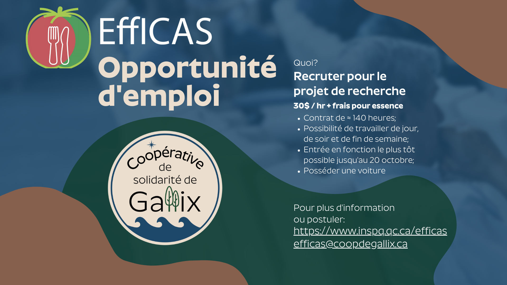

Bon lundi matin!

Plusieurs de nos membres ont participé au projet de recherche EffICAS de l'INSPQ et celui-ci cherche à embaucher une personne de Gallix afin d'aider au recrutement pour les prochaines étapes du projet et nous aider à obtenir des bonnes données. Il s'agit d'un contrat d'environ 140 heures avec horaire flexible qui paie 30$ de l'heure.

Si vous êtes intéressé(e) par cette offre vous pouvez écrire à info.efficas@inspq.qc.ca ou appeler au 1-866-457-4624. Au plaisir de discuter avec vous!

Un gros merci,

