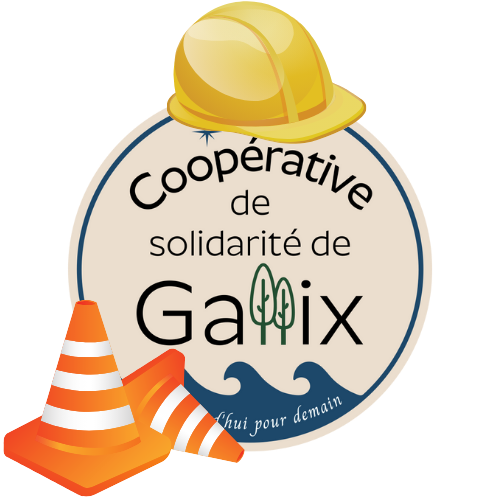

## À tous les membres de la Coop,

Voici les travaux que nous avons effectué depuis juin dernier :  
- Octroi du contrat à l’équipe de BGA construction pour la gestion de projet 
- Signature de contrat avec plusieurs sous-traitants lié à la construction et choix des matériaux
- Coordination avec Hydro-Québec pour l’alimentation électrique du site
- Coordination avec le groupe Harnois pour planifier l’installation des réservoirs et autres équipements lié à la station service
- Effectuer la connexion des services de la Ville de Sept-Îles
- L’excavation du terrain 
- La coulée de la fondation
- Les commande des murs et des fermes de toit 

Nous avons dû mettre sur pause les travaux pendant les 2 semaines de la construction qui s'achèvent et nous sommes en attente de la confirmation des dates de livraison de quelques matériaux. Nous souhaitons procéder à l’installation des murs de notre COOP dès que possible! 😃

Le projet progresse bien et nous sommes très heureux de la collaboration de tous les intervenants! Nous vous tiendrons informés chaque mois des avancées des travaux! 

Si vous avez des questions, n'hésitez pas à nous écrire!

---

PS: Nous vous invitons à [suivre notre page Facebook](https://facebook.com/CoopdeGallix). Si vous avez des réflexions, commentaires ou questions, merci de les acheminer à l'équipe à [info@coopdegallix.ca](mailto:info@coopdegallix.ca) ou par téléphone au [418-965-1691](tel:418-965-1691).
